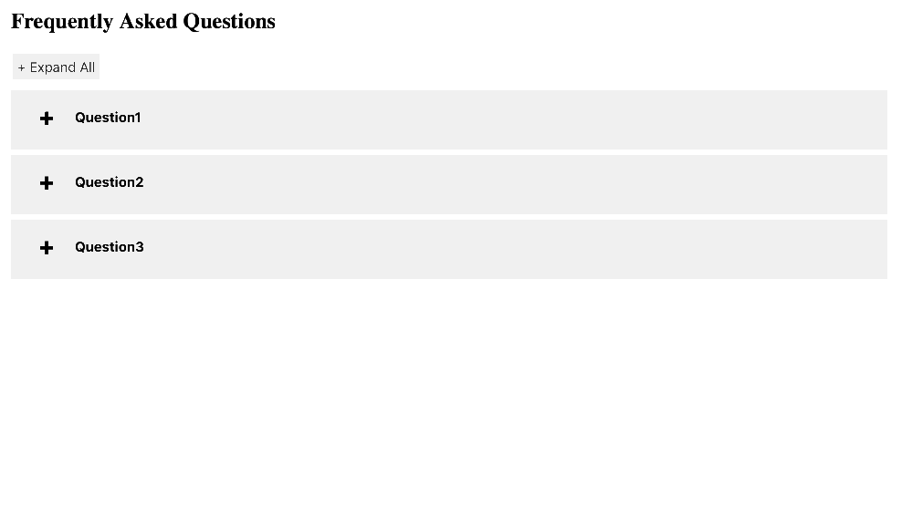
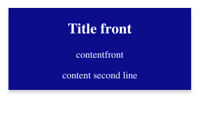
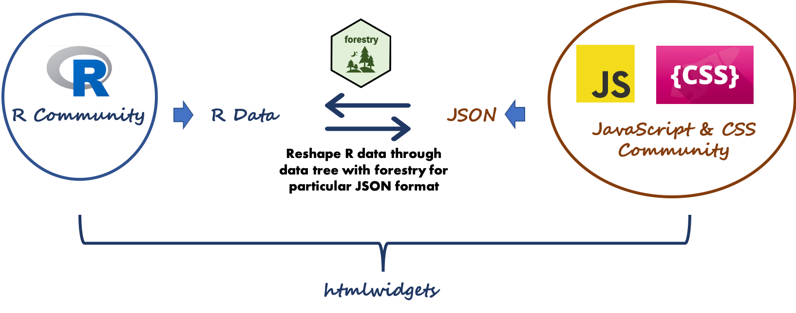
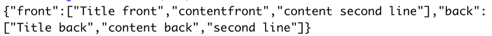

class: middle

# Htmlwidgets R 包

--
### 提供了R语言链接Javascript库的接口

--
### 方便和丰富了R Markdown文档和Shiny Web应用程序的开发和共享分析成果

--
### 比如目前流行的 leaflet， plotly，等等

---

# 例子1: `faq`  

Github repo: https://github.com/jienagu/faq

```{r faq, eval=TRUE}
library(faq)
df <- data.frame(
  question = c("Question1", "Question2", "Question3"),
  answer = c("answer for <b>question1</b>", 
             "question2 answer", 
             "answer3")
)
print(df)
```

---

# 例子1: `faq`  

[](https://cran.r-project.org/package=faq)

```{r faq2, eval=FALSE}
faq::faq(data = df, elementId = "faq",
         faqtitle = "FAQs")
```



---

# 例子2: `flashCard`  

Github repo: https://github.com/jienagu/flashCard

[](https://cran.r-project.org/package=flashCard)

```{r flashCard, eval=FALSE, out.height='60%'}
library(flashCard)
df1 <- data.frame(
  front = c("Title front",
            "contentfront", 
            "content second line"),
  back =c("Title back",
          "content back", 
          "second line")
)
flashCard(df1, elementId = "card", 
          front_text_color = "white")
```



*更多例子： https://www.htmlwidgets.org/*

---
class: middle

# Htmlwidgets 架构



*注：`forestry` 包（https://github.com/jienagu/forestry）是用于重塑更复杂的内嵌式的 JSON*

---
class: middle

# 开发流程 

1. 前端开发：https://codepen.io/Jienagu/pen/qBdNbVy
2. 摘取相应的 JSON 数据格式
3. 转换 JSON 到 R 环境  
4. 用 htmlwidgets R 包(https://cran.r-project.org/web/packages/htmlwidgets/index.html) 建立基本框架
5. 把开发好的前端代码 （js， css）放到 inst/htmlwidgets/lib 目录里 （https://github.com/jienagu/faq/tree/master/inst/htmlwidgets）
6. 建立 R 数据链接 （https://github.com/jienagu/faq/blob/master/inst/htmlwidgets/faq.js#L25）
7. 写测试

---
class: middle

# 开发流程 (从 JSON 到 R 数据)

JSON 数据：

```{js example, eval=FALSE, out.height='60%'}
var jsonData = {
	"front": ["Title front", "contentfront", "content second line"],
	"back": ["Title back", "<b>content back</b>", ""]
}
```

R 环境：
```{r ex, eval=TRUE}
data.frame(rjson::fromJSON('{
	"front": ["Title front", "contentfront", "content second line"],
	"back": ["Title back", "<b>content back</b>", ""]
}'))
```

---
class: middle

# 开发流程 (从 R 到 JSON 数据)

R 环境：

```{r ex3, eval=FALSE, out.width='80%'}
library(htmlwidgets)
df1 <- data.frame(
  front = c("Title front",
            "contentfront", 
            "content second line"),
  back =c("Title back",
          "content back", 
          "second line")
)
## 转换到 JSON
htmlwidgets:::toJSON(df1)
```



---
class: middle

# 勇于尝试


---
class: middle

# 为开源社区贡献


---
class: middle

# 谢谢
